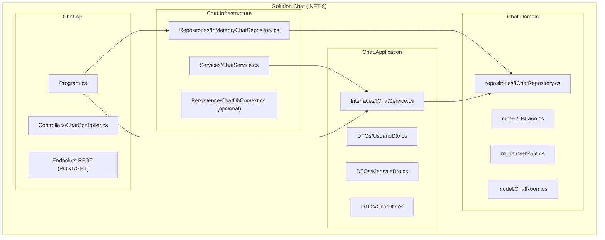

# Forma simple y práctica, qué meter en cada capa y por qué 
## suficientemente concreto para implementarlo en tu solución.

### Objetivo del proyecto (resumen)
- Permitir múltiples salas de chat (`ChatRoom`) sin base de datos por ahora.
- Usar patrón Repositorio para poder cambiar a BD más adelante.
- Para enviar mensajes, el usuario debe existir previamente en la sala.
- Seguir Clean Architecture y principios DDD (entidades ricas y agregados simples).

---

### Domain (núcleo de la lógica)
- Qué poner: entidades, value objects, reglas de negocio puras, excepciones de dominio, interfaces de repositorio.
- Entidades/agregado:
  - `ChatRoom` (Aggregate Root): contiene `Usuarios` y `Mensajes`.
  - `Usuario` (entidad): identidad por `UserName` dentro de una sala.
  - `Mensaje` (entidad): referencia a `Usuario`, `Contenido`, `FechaEnvio`.
- Reglas clave (invariantes):
  - No se pueden duplicar usuarios por `UserName` dentro de una sala.
  - No se puede enviar mensaje si el usuario no existe en la sala.
  - El contenido del mensaje no puede ser vacío.
- Interfaz repositorio: `IChatRepository` (contrato, sin lógica) para trabajar con `ChatRoom`.

### Application (casos de uso / orquestación)
- Qué poner: DTOs, contratos de servicios (`IChatService`), validación de entrada, orquestación de casos de uso.
- Casos de uso mínimos:
  - Crear sala: `CreateChatRoomAsync`.
  - Listar salas: `ListChatRoomsAsync` (opcional pero recomendable).
  - Obtener sala: `GetChatRoomAsync`.
  - Añadir usuario a sala: `AddUserAsync`.
  - Enviar mensaje: `SendMessageAsync` (requiere usuario existente).
- Mapear entre entidades y DTOs (manual u `AutoMapper`, opcional ahora).

### Infrastructure (implementaciones concretas)
- Qué poner: `InMemoryChatRepository` (sin BD) y `ChatService` (implementación de `IChatService`).
- `InMemoryChatRepository` debe soportar múltiples salas y ser seguro para acceso concurrente básico.
- Más adelante podrás reemplazar por `EfChatRepository` + `ChatDbContext`.

### Api (exposición HTTP)
- Controlador `ChatController` con endpoints REST mínimos:
  - `POST /api/chats` -> crea una sala (devuelve id).
  - `GET /api/chats` -> lista salas.
  - `GET /api/chats/{id}` -> obtiene sala por id.
  - `POST /api/chats/{id}/users` -> añade usuario a sala.
  - `POST /api/chats/{id}/messages` -> envía mensaje (usuario debe existir).

### Dependencias entre proyectos (reglas)
- `Chat.Domain` <- aislado.
- `Chat.Application` -> `Chat.Domain`.
- `Chat.Infrastructure` -> `Chat.Domain`, `Chat.Application`.
- `Chat.Api` -> `Chat.Application`, `Chat.Infrastructure`.

### Qué es necesario ahora (imprescindible)
1) Domain
- Hacer `public` las entidades (`Usuario`, `Mensaje`, `ChatRoom`).
- Inicializar colecciones en `ChatRoom` (listas vacías por defecto).
- Definir interfaz `IChatRepository` con métodos necesarios (ver firmas abajo).
- (Opcional recomendado) Agregar métodos de dominio a `ChatRoom` para validar invariantes: `AddUser`, `AddMessage` (solo firmas si prefieres implementar después).

2) Application
- Crear DTOs: `UsuarioDto`, `MensajeDto`, `ChatDto`, `ChatRoomDto` (si distingues `Chat` vs `ChatRoom`).
- Definir `IChatService` con los casos de uso descritos (firmas).

3) Infrastructure
- Implementar `InMemoryChatRepository` (sin BD) con almacenamiento en memoria para múltiples salas.
- Implementar `ChatService` usando el repositorio y aplicando las reglas (no enviar mensajes si usuario no existe).
- Registrar en DI (repositorio + servicio).

4) Api
- Crear `ChatController` con los endpoints REST mínimos arriba.

### Qué NO es necesario ahora (posponer)
- EF Core, migraciones, `DbContext` (posponer hasta querer BD).
- Autenticación/autorización.
- AutoMapper/FluentValidation (útiles pero prescindibles al inicio).
- Paginación y filtros de mensajes (añadir más adelante).

---

## Checklist práctica (paso a paso)
1. Domain
   - Asegurar `public` en `Chat.Domain\model\Usuario.cs`, `Mensaje.cs`, `ChatRoom.cs`.
   - Inicializar listas en `ChatRoom`.
   - Crear `Chat.Domain\repositories\IChatRepository.cs` (firmas abajo).
2. Application
   - Crear `Chat.Application\DTOs`: `UsuarioDto`, `MensajeDto`, `ChatDto` (y/o `ChatRoomDto`).
   - Crear `Chat.Application\Interfaces\IChatService.cs` con firmas abajo.
3. Infrastructure
   - Crear `Chat.Infrastructure\Repositories\InMemoryChatRepository.cs` con soporte para múltiples salas (stubs aceptables si implementarás después).
   - Crear `Chat.Infrastructure\Services\ChatService.cs` que use el repositorio.
   - Registrar en `Chat.Api\Program.cs`: `IChatRepository` e `IChatService`.
4. Api
   - Crear `Chat.Api\Controllers\ChatController.cs` con endpoints REST.
5. Probar
   - Crear sala -> añadir usuario -> enviar mensaje -> obtener sala.

---

## Firmas de contratos (qué deben hacer, no cómo)

### Repositorio en Domain (`Chat.Domain\repositories\IChatRepository.cs`)
```csharp
using System.Collections.Generic;
using System.Threading.Tasks;
using Chat.Domain.model;

namespace Chat.Domain.repositories
{
    public interface IChatRepository
    {
        // Crea una nueva sala y la devuelve (con id asignado)
        Task<ChatRoom> CreateChatAsync();

        // Devuelve la sala por id o null si no existe
        Task<ChatRoom?> GetChatAsync(int id);

        // Devuelve todas las salas (ids y/o info básica)
        Task<IEnumerable<ChatRoom>> ListChatsAsync();

        // Devuelve los usuarios de una sala
        Task<IEnumerable<Usuario>> GetUsuariosAsync(int chatId);

        // Devuelve los mensajes de una sala
        Task<IEnumerable<Mensaje>> GetMensajesAsync(int chatId);

        // Añade un usuario a la sala (no duplicar por UserName)
        Task AddUsuarioAsync(int chatId, Usuario usuario);

        // Añade un mensaje a la sala (el usuario debe existir)
        Task AddMensajeAsync(int chatId, Mensaje mensaje);

        // Persiste cambios si aplica (en memoria: no-op)
        Task SaveChangesAsync();
    }
}
```

### Servicio de aplicación (`Chat.Application\Interfaces\IChatService.cs`)
```csharp
using System.Collections.Generic;
using System.Threading.Tasks;
using Chat.Application.DTOs;

namespace Chat.Application.Interfaces
{
    public interface IChatService
    {
        // Crea una sala y devuelve su id o DTO
        Task<int> CreateChatRoomAsync();

        // Lista salas (ids o info básica)
        Task<IEnumerable<int>> ListChatRoomsAsync();

        // Devuelve los datos de una sala
        Task<ChatDto> GetChatRoomAsync(int chatId);

        // Añade un usuario a una sala
        Task AddUserAsync(int chatId, UsuarioDto usuario);

        // Envía un mensaje (usuario debe existir previamente)
        Task<MensajeDto> SendMessageAsync(int chatId, MensajeDto mensaje);
    }
}
```

### DTOs sugeridos (`Chat.Application\DTOs`)
- `UsuarioDto`: `UserName`, `FotoPerfilBase64?`.
- `MensajeDto`: `UserName`, `Contenido`, `FechaEnvio`.
- `ChatDto`: `Usuarios: List<UsuarioDto>`, `Mensajes: List<MensajeDto>`.

---

## Pautas de implementación (alto nivel)
- `InMemoryChatRepository`
  - Mantener un diccionario en memoria `chatId -> ChatRoom` (p.ej. `ConcurrentDictionary<int, ChatRoom>`).
  - Asignar ids incrementales a nuevas salas.
  - Asegurar que añadir usuario no lo duplique por `UserName`.
  - Al añadir mensaje, verificar que el usuario exista; si no, fallar (o decide si auto-creas usuario; la guía recomienda requerir alta previa).
- `ChatService`
  - Validar entradas (id > 0, `UserName` no vacío, `Contenido` no vacío).
  - Orquestar llamadas al repositorio y mapear a DTOs.
- `ChatController`
  - Exponer endpoints REST; retornar 404 si la sala no existe; 400 si validaciones fallan.

---

## Registro en DI (`Chat.Api\Program.cs`)
- Registrar repositorio e implementación del servicio:
```csharp
builder.Services.AddSingleton<IChatRepository, InMemoryChatRepository>();
builder.Services.AddScoped<IChatService, ChatService>();
```

---

## Opcionales (añadir más adelante)
- Persistencia real con EF Core (`ChatDbContext`, `EfChatRepository`).
- `AutoMapper` para mapeos.
- `FluentValidation` para validaciones.
- Autenticación/autorización.
- Paginación/filtros en consultas de mensajes.

---
## Estructura de carpetas y proyectos


---

## Notas DDD/Clean Architecture
- `ChatRoom` es el agregado principal; manten las reglas dentro de la entidad/agregado cuando sea posible.
- Los controladores no contienen lógica de negocio; delegan al servicio.
- El repositorio oculta la persistencia y permite cambiar a BD sin tocar Application.